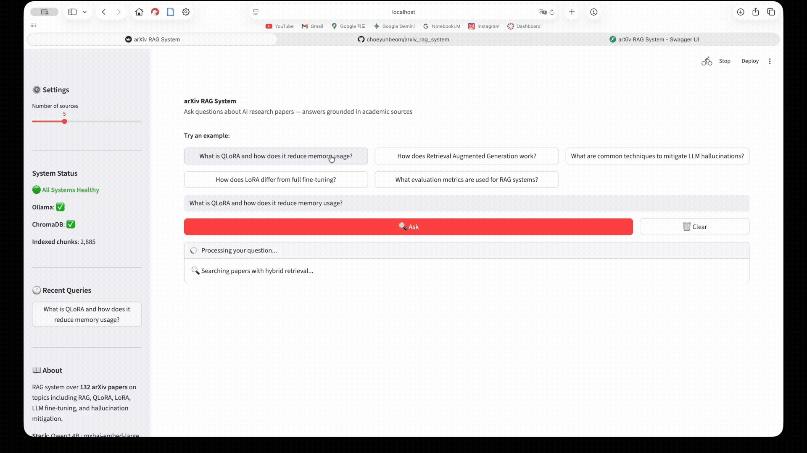
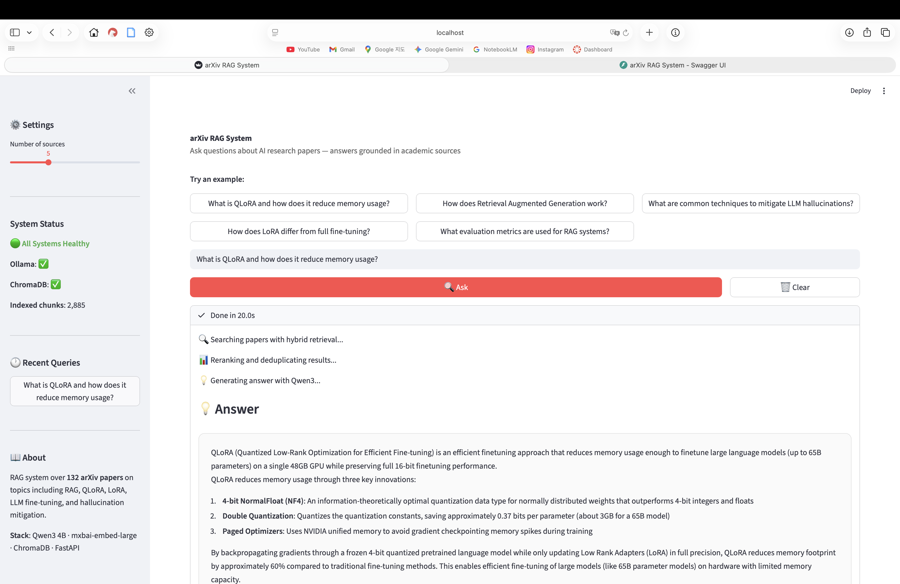
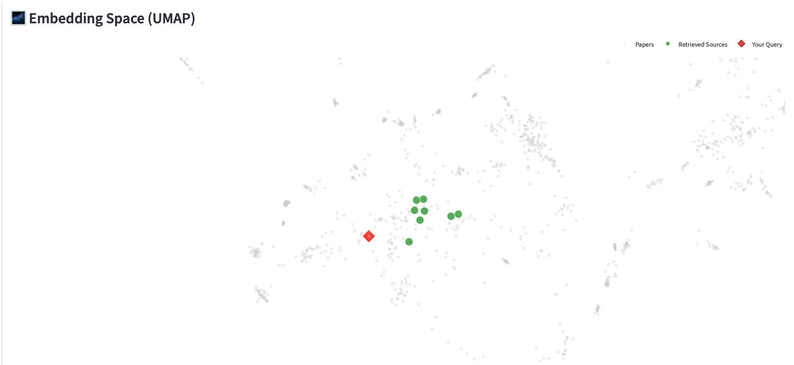
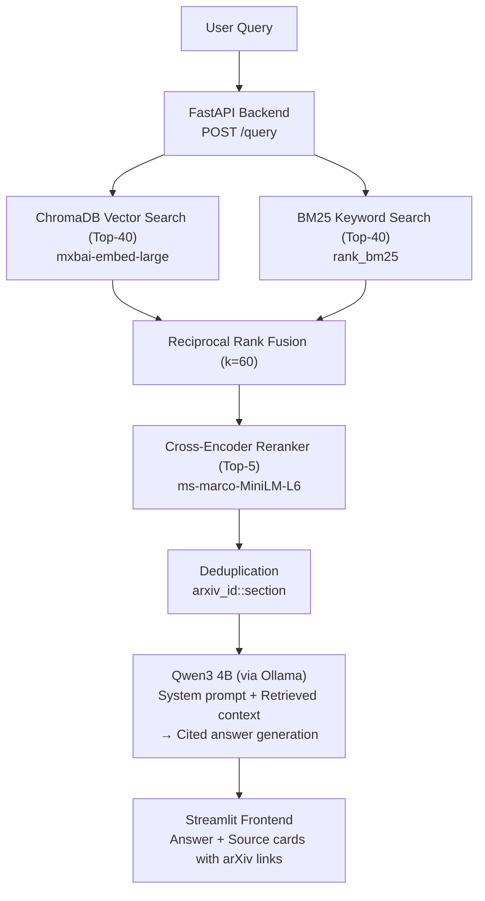

# arXiv RAG System

A Retrieval-Augmented Generation system for querying academic papers from arXiv. Built as a portfolio project demonstrating end-to-end ML engineering: data pipeline, hybrid retrieval, LLM fine-tuning, and systematic evaluation.

Ask a question in natural language → the system retrieves relevant papers → generates a cited, grounded answer.

📝 **Blog Post:** [Building an End-to-End arXiv RAG System](https://choeyunbeom.github.io/machine%20learning/nlp/arxiv-rag-system/)

## Demo






> The UI shows the full query flow: enter a question → hybrid retrieval searches 153 arXiv papers → cross-encoder reranks results → Qwen3 4B generates a cited answer. 3D UMAP visualisations map the query to the semantic space of the arXiv corpus. Latency breakdown shows retrieval vs generation time.

## Architecture



## Key Results

### Retrieval Optimisation

| Stage | Hit Rate | MRR | Key Change |
|-------|----------|-----|------------|
| Baseline | 60% | 0.51 | 128-word chunks, dense vector only |
| + Chunk optimisation | 67% | 0.42 | 200-word chunks, fault-tolerant indexer |
| + BM25 Hybrid Search | 73% | 0.52 | Reciprocal Rank Fusion with keyword search |
| **+ Reranker + Dedup** | **100%** | **0.82** | Cross-encoder reranking, section-level dedup |

### Prompt Engineering vs Fine-Tuning

Compared three answer generation strategies on the same 15-question benchmark under identical retrieval conditions:

| Metric | Zero-Shot | Few-Shot | Fine-Tuned |
|--------|-----------|----------|------------|
| Keyword Coverage | 76.4% | **78.0%** | 48.0% |
| BERTScore F1 | 0.786 | **0.805** | 0.683 |
| Source Hit Rate | 100% | 100% | 100% |
| Substantive Rate | 100% | 100% | 100% |
| Avg Word Count | 175 | 177 | 1,614 |
| Avg Latency | 20.0s | 20.8s | 47.7s |

Few-shot prompt engineering outperformed both zero-shot and fine-tuning on both keyword and semantic metrics. BERTScore confirms the fine-tuning regression is not merely a keyword matching artifact — see [Fine-Tuning Analysis](#why-fine-tuning-didnt-improve-metrics) for the full breakdown.

## Tech Stack

| Component | Technology |
|-----------|-----------|
| LLM | Qwen3 4B (Ollama, Apple Silicon Metal) |
| Embeddings | mxbai-embed-large (Ollama) |
| Vector Store | ChromaDB (Docker) |
| Sparse Search | rank_bm25 |
| Reranker | cross-encoder/ms-marco-MiniLM-L-6-v2 |
| Backend | FastAPI |
| Frontend | Streamlit |
| Fine-Tuning | LoRA via PEFT + trl (SFTTrainer) |
| CI/CD | GitHub Actions (ruff + pytest) |
| Deployment | Docker Compose |
| Testing | pytest (104 tests) |
| Config | Pydantic Settings |

## Project Structure

```
arxiv_rag_system/
├── .github/workflows/ci.yml        # GitHub Actions: lint + test on push/PR
├── src/
│   ├── api/
│   │   ├── core/
│   │   │   ├── config.py            # Centralised Pydantic settings
│   │   │   ├── hybrid_retriever.py  # Dense + BM25 + reranker pipeline
│   │   │   ├── llm_client.py        # Ollama API wrapper
│   │   │   ├── rag_chain.py         # Retrieval → Generation orchestrator
│   │   │   ├── prompts.py           # Prompt templates (zero-shot, few-shot)
│   │   │   └── chunker.py           # Token-aware chunking with quality filters
│   │   ├── models/schemas.py        # Request/response Pydantic models
│   │   ├── routers/
│   │   │   ├── query.py             # POST /query endpoint
│   │   │   └── health.py            # GET /health endpoint
│   │   └── main.py                  # App entry with lifespan pre-loading
│   ├── ingestion/
│   │   ├── arxiv_crawler.py         # arXiv API crawler with retry logic
│   │   ├── pdf_parser.py            # PDF → Markdown (pymupdf4llm)
│   │   └── indexer.py               # ChromaDB batch indexer
│   ├── evaluation/
│   │   ├── eval_dataset.py          # 15-question benchmark dataset
│   │   └── evaluate.py              # Automated retrieval + answer metrics
│   └── finetuning/
│       ├── generate_qa_dataset.py   # Synthetic Q&A generation pipeline
│       └── finetune_lora.ipynb      # LoRA training notebook
├── scripts/
│   └── run_fewshot_experiment.py    # 3-way prompt comparison orchestrator
├── tests/
│   ├── test_chunker.py              # 33 unit tests
│   ├── test_llm_client.py           # 16 unit tests
│   ├── test_rag_chain.py            # 17 unit tests
│   ├── test_hybrid_retriever.py     # 19 unit tests
│   └── test_api_integration.py      # 19 integration tests
├── ui/app.py                        # Streamlit frontend
├── data/
│   ├── raw/                         # 153 arXiv PDFs
│   ├── processed/                   # Chunks, metadata, eval results
│   ├── base_model/                  # Qwen3-4B weights (git-ignored)
│   └── finetuned_lora/              # LoRA adapter + checkpoints (git-ignored)
├── Dockerfile.api                   # FastAPI backend container
├── Dockerfile.ui                    # Streamlit frontend container
├── docker-compose.yml               # Full-stack deployment
├── Makefile                         # Dev shortcuts
└── docs/                            # Detailed experiment logs
```

## Setup

### Prerequisites

- Python 3.11+
- Docker Desktop
- Ollama (for LLM + embeddings)

### Quick Start

```bash
# 1. Clone the repository
git clone https://github.com/choeyunbeom/arxiv_rag_system.git
cd arxiv_rag_system

# 2. Pull Ollama models (must run on host for Metal GPU)
ollama pull qwen3:4b
ollama pull mxbai-embed-large

# 3. Setup Python environment and install dependencies
uv venv && source .venv/bin/activate
uv pip install -e ".[dev]"

# 4. Start ChromaDB and index the data
docker compose up chromadb -d
make seed

# 5. Start all services
docker compose up --build
```

The API is available at `http://localhost:8000/docs` and the UI at `http://localhost:8501`.

### Local Development

```bash
# Create virtual environment
uv venv && source .venv/bin/activate

# Install dependencies
uv pip install -e ".[dev]"

# Start ChromaDB only
docker compose up chromadb -d

# Start the API server
uvicorn src.api.main:app --reload

# Start the UI (in another terminal)
streamlit run ui/app.py

# Run tests
pytest tests/ -v
```

### Data Pipeline

```bash
# 1. Crawl arXiv papers
python -m src.ingestion.arxiv_crawler

# 2. Parse PDFs to Markdown
python -m src.ingestion.pdf_parser

# 3. Index chunks into ChromaDB
python -m src.ingestion.indexer

# 4. Precompute UMAP 3D Visualization Data (Required for UI Graph)
python -m scripts.precompute_umap
```

## Engineering Decisions

### Embedding Model Selection

Initial choice of `nomic-embed-text` via Ollama produced an inverted vector space — irrelevant documents scored higher than relevant ones. A 3-line cosine similarity sanity check caught the failure:

| Pair | nomic-embed-text | mxbai-embed-large |
|------|-----------------|-------------------|
| Query ↔ Relevant chunk | 0.41 | **0.76** |
| Query ↔ Irrelevant chunk | **0.60** | 0.49 |

Root cause: Ollama's GGUF-quantised `nomic-embed-text` does not preserve task-specific retrieval behaviour from the original Hugging Face model. Switched to `mxbai-embed-large` which correctly ranks relevant documents higher.

**Lesson**: Never trust an embedding model without a basic sanity check. Three lines of code prevented a completely broken RAG system.

### Token-Based Chunking

Word-count chunking (200 words) caused 2.2% of chunks to fail embedding due to token overflow. Academic text has a 2.27x token-to-word ratio (vs 1.27x for normal text) because of LaTeX, markdown tables, and special characters. Switching to BPE tokeniser-based splitting at 450 tokens reduced failures from 116 to 1.

### Hybrid Retrieval

Academic queries contain domain-specific terms (QLoRA, NF4, RAGAS) where exact keyword matching outperforms semantic similarity. Combining BM25 sparse search with dense vector search via Reciprocal Rank Fusion captures both semantic meaning and keyword precision, improving Hit Rate from 67% to 73%.

### Cross-Encoder Reranking

A bi-encoder retriever scores query-document pairs independently. A cross-encoder jointly attends to both, producing much more accurate relevance scores at the cost of speed. By using the cross-encoder only on the top-40 candidates from hybrid search, we get high-quality reranking with minimal latency overhead (+1.3s for a transformative quality improvement from 73% → 100% Hit Rate).

### Few-Shot Prompt Engineering

Designed token-optimised few-shot examples (~350 tokens overhead) covering three RAG behaviours: context-grounded answering, multi-paper synthesis, and refusal. This approach improved keyword coverage by +1.6%p with only +0.8s latency — more effective and far cheaper than 6.8 hours of LoRA fine-tuning that produced a -28.4%p regression.

## Why Fine-Tuning Didn't Improve Metrics

### What I Tried

Generated 1,997 synthetic Q&A training examples across three categories designed to address specific base model weaknesses:

| Type | Count | Purpose |
|------|-------|---------|
| Grounded (60%) | 1,200 | Context-only answering with paper attribution |
| Synthesis (20%) | 397 | Multi-paper comparison in prose (no markdown) |
| Refusal (20%) | 400 | Proper refusal when context is insufficient |

Training configuration: LoRA (r=16, α=32) on all attention + MLP projections, 3 epochs with cosine LR schedule, bf16 on Apple M4 Pro. Best checkpoint at epoch 2 (val_loss: 1.060).

### What Happened

The fine-tuned model scored drastically lower on keyword coverage (-28.4%p) with 8x higher word counts and 2.4x higher latency. Inspection of responses revealed the dominant failure mode: **every response begins by repeating the system prompt instructions verbatim**, inflating word counts to ~1,600 and displacing actual answer content.

### Root Cause: Training Data Contamination

The synthetic data generation pipeline (Day 4) used Qwen3's `format: json` with thinking mode enabled. The model's `thinking` field contained system prompt fragments mixed with reasoning. When these were extracted as training answers, the model learned to reproduce instruction text as part of its response — a form of **training data contamination** where the model memorised prompt scaffolding rather than learning the intended answering behaviour.

Additional contributing factors include catastrophic forgetting in the 4B model and quantisation differences between base (Q4_K_M) and fine-tuned (Q8_0) models. BERTScore evaluation (F1: 0.805 few-shot vs 0.683 fine-tuned) confirms the degradation is real and measurable at the semantic level, not just a keyword matching artifact.

### What I Would Do Differently

- **Validate training data for instruction leakage**: Add automated checks that reject any training answer containing system prompt fragments
- **Use a separate model for data generation**: Avoid the thinking mode contamination issue by generating data with a different (typically larger) model
- **Start with few-shot baseline before fine-tuning**: Establish prompt engineering ceiling first, then fine-tune only if there is a clear gap
- **Use a larger base model (7B+)** to reduce catastrophic forgetting risk

## Development Timeline

| Day | Focus | Key Outcomes |
|-----|-------|-------------|
| 1 | Infrastructure | 153 papers crawled, parsed, chunked, indexed. Caught embedding model failure via cosine similarity test. |
| 2 | RAG Pipeline | FastAPI + Streamlit serving. Evaluation pipeline with 15-question benchmark. Qwen3 thinking mode fix. |
| 3 | Retrieval Optimisation | Hit Rate 60% → 100%, MRR 0.51 → 0.82. Hybrid search + cross-encoder reranking. |
| 4 | Fine-Tuning Prep | 1,997 synthetic Q&A pairs generated. Code quality refactoring (9 fixes). |
| 5 | Fine-Tuning & Eval | LoRA training, GGUF conversion, Ollama deployment. Honest evaluation showing regression — analysed root causes. |
| 6 | Testing & CI/CD | 104 tests (unit + integration). GitHub Actions CI. Docker Compose full-stack deployment. Few-shot experiment revealing training data contamination as fine-tuning root cause. |
| 7 | UI & Demo | Streamlit UI improvements (error handling, latency visualisation). API documentation. Makefile + Docker healthchecks. BERTScore semantic evaluation. |
| 8 | Async Refactoring & Bug Fixes | Full async pipeline (httpx.AsyncClient, async/await throughout). 7 bugs fixed. All 104 tests passing. |

## Detailed Logs

For full experiment data, debugging notes, and the project retrospective:

- 📝 **[Project Write-up (Blog)](https://choeyunbeom.github.io/machine%20learning/nlp/arxiv-rag-system/)**
- [Development Log](docs/Development_log.md)
- [Embedding Model Debugging](docs/embedding_model_debugging.md)
- [Retrieval Optimisation Experiments](docs/retrieval_optimisation.md)
- [Fine-Tuning Experiment Log](docs/finetuning_experiment.md)
---
## Async Refactoring 

The entire request pipeline was blocking — `httpx.Client` in both `HybridRetriever` and `LLMClient` meant every query tied up a thread waiting on I/O. Refactored to fully async.

### What Changed

| File | Change |
|------|--------|
| `hybrid_retriever.py` | `httpx.Client` → `httpx.AsyncClient`, `search()` and `_embed_query()` → `async def` |
| `llm_client.py` | `httpx.Client` → `httpx.AsyncClient`, `generate()` → `async def` |
| `rag_chain.py` | `query()` → `async def`, `await retriever.search()`, `await llm.generate()` |
| `routers/query.py` | `def query()` → `async def query()`, `await rag_chain.query()` |
| `evaluation/evaluate.py` | All evaluation functions → `async def`, `asyncio.run()` entry point |

### Bugs Fixed

1. **UMAP dead code** — `rag_chain.py` had identical UMAP computation blocks written twice; the second overwrote the first silently
2. **Tuple unpacking** — `evaluate.py` called `retriever.search()` without unpacking the `(chunks, embeddings)` tuple, causing a runtime `TypeError`
3. **HTTP client leak** — `HybridRetriever` and `LLMClient` never closed their `httpx` clients; added `__del__()` cleanup
4. **Chunker condition bug** — `if not sections or "full_text" in sections` incorrectly merged two distinct cases into one branch; split into explicit `if/elif`
5. **MD5 → SHA256** — `generate_chunk_id()` used `hashlib.md5` which fails on FIPS-compliant systems; replaced with `sha256`
6. **`/no_think` duplication** — Qwen3's `no_think` directive was injected into both `system` and `prompt` fields; removed from `prompt` (only needed in `system`)
7. **Import ordering (E402)** — `indexer.py` declared `logger` between `import` statements, violating PEP 8 module-level import ordering enforced by ruff

All 104 tests pass after these changes.

## Known Limitations & Scaling Considerations

- **In-memory BM25**: All chunks loaded into memory. Sufficient for 153 papers (~5K chunks), but would require ElasticSearch/OpenSearch for larger corpora.
- **Single-worker FastAPI**: Currently runs with a single Uvicorn worker. Horizontal scaling would require a shared-state solution for the BM25 index (currently in-process memory).
- **Ollama not containerised**: Runs on host for Apple Silicon Metal GPU access. For cloud deployment, would need a GPU-enabled container or API-based LLM service.

## License

MIT